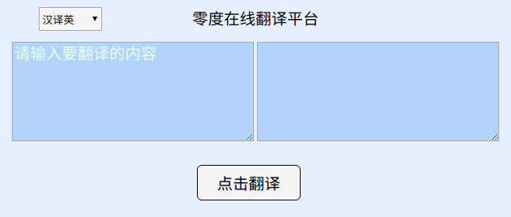

# 			  零度在线翻译爬虫教程

**运行环境**

```python
- python 3.6 版本
- django 1.11.8 版本
- pyexejs 1.15.1 版本
```

**功能描述:**

```python
- 逐步破解百度翻译的反爬机制
- 下载并使用pyexejs模块解析js代码
- 通过requests模块向百度翻译发送POST请求,获取翻译结果
```

**获取步骤：**

```python
1. F12进行抓包,找到xhr里的json地址,观察Form表单数据
2. 发现sign是变化的，需要弄清它如何生成,及获取固定不变的token
3. 点击右上角,搜索sign:,找到具体的js文件,并格式化输出显示
4. 在格式化输出的js代码中,设置断点找到生成sign的具体函数
5. 将这部分代码写入本地js文件,利用pyexecjs模块执行js文件
6. 生成解析对象调用eval方法,根据输入的单词获取sign
7. 利用正则表达式匹配响应地址中的token
8. 最终根据token和sign以及输入的单词,发送post请求获取翻译结果
```

**如何开启：**

```python
1. linux或windows下，进入 lingdu 文件目录
2. 终端 运行 python3 manage.py runserver 命令
3. 默认是8000端口，在浏览器中输入 http://127.0.0.1:8000/index/
4. 最后可以正常起开项目
```

**界面展示：**




